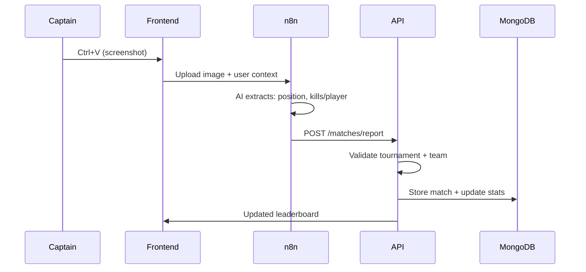

# 🎯 Implementation Plan: Screenshot-Based Match Reporting System

**Feature**: Automatic match ingestion via screenshot + n8n AI processing  
**Target**: Phase 1 - Data & Rankings with Tournament Context  
**Created**: February 7, 2026

---

## 🧠 System Flow (High Level)



---

## 📊 Data Model Design

### Core Entities Needed

#### 1. **Tournament** (NEW)
```go
type Tournament struct {
    ID          uuid.UUID
    GameID      uuid.UUID
    Name        string
    Description string
    TeamSize    TeamSize  // duos(2), trios(3), quads(4)
    Status      TournamentStatus
    Rules       TournamentRules
    StartDate   time.Time
    EndDate     time.Time
    CreatedBy   uuid.UUID  // UserID (admin)
    CreatedAt   time.Time
    UpdatedAt   time.Time
}

type TournamentStatus string
const (
    StatusDraft    TournamentStatus = "draft"
    StatusOpen     TournamentStatus = "open"      // Accepting registrations
    StatusActive   TournamentStatus = "active"    // In progress
    StatusFinished TournamentStatus = "finished"
    StatusCanceled TournamentStatus = "canceled"
)

type TeamSize int
const (
    TeamSizeSolo  TeamSize = 1
    TeamSizeDuos  TeamSize = 2
    TeamSizeTrios TeamSize = 3
    TeamSizeQuads TeamSize = 4
)
```

#### 2. **Team** (NEW)
```go
type Team struct {
    ID           uuid.UUID
    TournamentID uuid.UUID
    Name         string
    CaptainID    uuid.UUID  // PlayerID
    MemberIDs    []uuid.UUID // PlayerIDs (including captain)
    Status       TeamStatus
    InviteCode   string     // For joining team
    CreatedAt    time.Time
    UpdatedAt    time.Time
}

type TeamStatus string
const (
    TeamStatusPending   TeamStatus = "pending"   // Waiting for members
    TeamStatusReady     TeamStatus = "ready"     // Full roster
    TeamStatusActive    TeamStatus = "active"    // In tournament
    TeamStatusEliminated TeamStatus = "eliminated"
)
```

#### 3. **Match** (NEW)
```go
type Match struct {
    ID           uuid.UUID
    TournamentID uuid.UUID
    TeamID       uuid.UUID
    GameID       uuid.UUID
    
    // Match Results
    TeamPlacement int                      // Position in match (1-100)
    TeamKills     int                      // Total team kills
    PlayerStats   map[uuid.UUID]PlayerMatchStats  // PlayerID -> stats
    
    // Metadata
    ScreenshotURL string
    ReportedBy    uuid.UUID  // PlayerID (captain)
    ReportedAt    time.Time
    MatchDate     time.Time
    
    // Validation
    Verified      bool
    VerifiedBy    *uuid.UUID  // Admin UserID
    VerifiedAt    *time.Time
    
    CreatedAt     time.Time
}

type PlayerMatchStats struct {
    PlayerID  uuid.UUID
    Kills     int
    Damage    int
    Assists   int
    Deaths    int
    // Additional stats based on game schema
    CustomStats map[string]interface{}
}
```

#### 4. **TournamentRegistration** (NEW)
```go
type TournamentRegistration struct {
    ID           uuid.UUID
    TournamentID uuid.UUID
    TeamID       uuid.UUID
    Status       RegistrationStatus
    RegisteredAt time.Time
}

type RegistrationStatus string
const (
    RegStatusPending  RegistrationStatus = "pending"
    RegStatusApproved RegistrationStatus = "approved"
    RegStatusRejected RegistrationStatus = "rejected"
)
```

---

## 🏗️ Implementation Phases

### Phase 1A: Tournament & Team Foundation (Week 1)

**Goal**: Create tournament and team management system

#### Tasks:
- [ ] **Domain Layer**
  - [ ] Create `internal/domain/tournament/tournament.go`
    - Tournament entity with validation
    - TournamentRules struct
    - Domain errors (ErrNotFound, ErrInvalidStatus, etc.)
  - [ ] Create `internal/domain/tournament/repository.go` (interface)
  - [ ] Create `internal/domain/team/team.go`
    - Team entity with roster validation
    - Captain role logic
    - Domain errors
  - [ ] Create `internal/domain/team/repository.go` (interface)

- [ ] **Infrastructure Layer**
  - [ ] Create `internal/infra/mongodb/tournament_repository.go`
    - CRUD operations
    - Find by status (active tournaments)
    - Find by game ID
  - [ ] Create `internal/infra/mongodb/team_repository.go`
    - CRUD operations
    - Find by tournament
    - Find teams for a player
    - Validate captain/member operations

- [ ] **Usecase Layer**
  - [ ] Create `internal/usecase/tournament/service.go`
    - CreateTournament(admin only)
    - ListTournaments(filters: status, game)
    - GetTournament(id)
    - UpdateTournamentStatus(admin only)
    - GetActiveTournamentForPlayer(playerID) ← Key for n8n
  - [ ] Create `internal/usecase/team/service.go`
    - CreateTeam(tournamentID, captainID)
    - InvitePlayer(teamID, playerID)
    - AcceptInvite(teamID, playerID)
    - ListTeamMembers(teamID)
    - GetPlayerActiveTeam(playerID, tournamentID)

- [ ] **HTTP Layer**
  - [ ] Create `internal/infra/http/handlers/tournament_handler.go`
    - POST /api/v1/tournaments (admin)
    - GET /api/v1/tournaments
    - GET /api/v1/tournaments/:id
    - PATCH /api/v1/tournaments/:id/status (admin)
    - GET /api/v1/players/me/active-tournament
  - [ ] Create `internal/infra/http/handlers/team_handler.go`
    - POST /api/v1/tournaments/:tournamentId/teams
    - GET /api/v1/tournaments/:tournamentId/teams
    - POST /api/v1/teams/:id/invite
    - POST /api/v1/teams/:id/join
    - GET /api/v1/teams/:id/members

**Validation Criteria**:
- ✅ Admin can create tournament (duos, trios, quads)
- ✅ Players can create teams in active tournament
- ✅ Captain can invite players
- ✅ System can determine "active tournament" for a player

---

### Phase 1B: Match Reporting Core (Week 2)

**Goal**: n8n can submit match results and system processes them

#### Tasks:
- [ ] **Domain Layer**
  - [ ] Create `internal/domain/match/match.go`
    - Match entity with team placement
    - PlayerMatchStats nested struct
    - Validation against game schema
    - Domain errors
  - [ ] Create `internal/domain/match/repository.go` (interface)

- [ ] **Infrastructure Layer**
  - [ ] Create `internal/infra/mongodb/match_repository.go`
    - Store match results
    - Query matches by tournament/team/player
    - List recent matches with pagination

- [ ] **Usecase Layer**
  - [ ] Create `internal/usecase/match/service.go`
    - SubmitMatch(req MatchSubmissionRequest)
      - Validate tournament is active
      - Validate team exists and reporter is captain
      - Validate player stats against game schema
      - Store match
      - Trigger stats update
    - GetMatchHistory(tournamentID, filters)
    - GetPlayerMatches(playerID, tournamentID)
  - [ ] Update `internal/usecase/player/service.go`
    - UpdateStatsFromMatch(match) ← Called after match submission
    - Recalculate ranking score
    - Update tier

- [ ] **HTTP Layer**
  - [ ] Create `internal/infra/http/handlers/match_handler.go`
    - POST /api/v1/matches/report ← n8n endpoint
      - Request body:
        ```json
        {
          "tournament_id": "uuid",
          "team_id": "uuid",
          "team_placement": 3,
          "team_kills": 15,
          "player_stats": [
            {
              "player_id": "uuid",
              "kills": 5,
              "damage": 1200,
              "assists": 2
            }
          ],
          "screenshot_url": "s3://...",
          "match_date": "2026-02-07T20:30:00Z"
        }
        ```
    - GET /api/v1/matches/tournament/:tournamentId
    - GET /api/v1/matches/team/:teamId
    - GET /api/v1/players/me/matches

**Validation Criteria**:
- ✅ n8n can POST match results with extracted data
- ✅ System validates captain authorization
- ✅ Player stats are updated automatically
- ✅ Leaderboard reflects new match results

---

### Phase 1C: Frontend Integration (Week 3)

**Goal**: Players can see tournaments, join teams, and paste screenshots

#### Tasks:
- [ ] **Services**
  - [ ] Create `frontend/src/services/tournaments.ts`
    - listTournaments()
    - getTournament(id)
    - getMyActiveTournament()
  - [ ] Create `frontend/src/services/teams.ts`
    - createTeam(tournamentId, name)
    - joinTeam(teamId, inviteCode)
    - getMyTeam(tournamentId)
    - getTeamMembers(teamId)
  - [ ] Create `frontend/src/services/matches.ts`
    - reportMatch(data)
    - getMatchHistory(tournamentId)
    - getMyMatches()

- [ ] **State Management**
  - [ ] Create `frontend/src/store/tournamentStore.ts`
    - Active tournament state
    - My team state
    - Match reporting state

- [ ] **Components**
  - [ ] Create `frontend/src/components/tournament/TournamentCard.tsx`
  - [ ] Create `frontend/src/components/tournament/TournamentList.tsx`
  - [ ] Create `frontend/src/components/team/TeamCreationForm.tsx`
  - [ ] Create `frontend/src/components/team/TeamRoster.tsx`
  - [ ] Create `frontend/src/components/match/ScreenshotUploader.tsx`
    - Ctrl+V listener
    - Image preview
    - Upload to n8n webhook
  - [ ] Create `frontend/src/components/match/MatchHistoryTable.tsx`

- [ ] **Pages**
  - [ ] Create `frontend/src/pages/TournamentsPage.tsx`
    - List available tournaments
    - Filter by status
  - [ ] Create `frontend/src/pages/TournamentDetailsPage.tsx`
    - Tournament info
    - My team section
    - Create/join team
    - Leaderboard
    - Match history
  - [ ] Create `frontend/src/pages/ReportMatchPage.tsx`
    - Screenshot uploader (Ctrl+V)
    - Form for manual corrections
    - Confirm & submit

**Validation Criteria**:
- ✅ User can see active tournaments
- ✅ User can create/join team
- ✅ Captain can paste screenshot (Ctrl+V)
- ✅ Screenshot uploads to n8n
- ✅ Match appears in history after processing

---

### Phase 1D: n8n Integration & AI Processing (Week 4)

**Goal**: n8n workflow processes screenshots and calls API

#### Tasks:
- [ ] **n8n Workflow Design**
  - [ ] Webhook endpoint receives:
    - Image file (base64 or URL)
    - Player token (JWT)
    - Tournament context
  - [ ] AI processing node (OpenAI Vision / Google Vision):
    - Extract team placement
    - Extract kills per player (OCR)
    - Confidence scores
  - [ ] Data mapping node:
    - Match extracted data to player IDs
    - Build API request body
  - [ ] HTTP Request node:
    - POST to `/api/v1/matches/report`
    - Include JWT for auth
  - [ ] Error handling:
    - Low confidence → notify for manual review
    - API errors → retry logic

- [ ] **Backend API Enhancements**
  - [ ] Add API key authentication for n8n (besides JWT)
  - [ ] Add webhook validation endpoint
  - [ ] Add match verification endpoint for admins:
    - GET /api/v1/matches/:id/verify
    - PATCH /api/v1/matches/:id/verify (admin)

- [ ] **Frontend Enhancements**
  - [ ] Add "Processing..." state after upload
  - [ ] Add notification when match is registered
  - [ ] Add "Pending Verification" badge on unverified matches

**Validation Criteria**:
- ✅ Screenshot uploaded triggers n8n workflow
- ✅ AI extracts placement + kills with reasonable accuracy
- ✅ n8n successfully calls API with proper auth
- ✅ User sees match in history within 30 seconds
- ✅ Admin can verify/reject matches

---

### Phase 1E: Testing & Polish (Week 5)

**Goal**: End-to-end testing and refinement

#### Tasks:
- [ ] **Unit Tests**
  - [ ] Tournament domain logic tests
  - [ ] Team validation tests
  - [ ] Match submission tests
  - [ ] Stats recalculation tests

- [ ] **Integration Tests**
  - [ ] Full match submission flow
  - [ ] Tournament lifecycle tests
  - [ ] Team registration tests

- [ ] **E2E Testing**
  - [ ] Create tournament → form teams → report match → verify leaderboard
  - [ ] Screenshot upload → n8n processing → API call → stats update
  - [ ] Multiple matches → ranking changes

- [ ] **Performance**
  - [ ] Index optimization for queries
  - [ ] Leaderboard caching (Redis)
  - [ ] Screenshot upload size limits

- [ ] **Documentation**
  - [ ] API documentation (Swagger/OpenAPI)
  - [ ] n8n workflow guide
  - [ ] Admin handbook (tournament management)
  - [ ] Player guide (how to report matches)

**Validation Criteria**:
- ✅ All tests passing
- ✅ API response times < 200ms
- ✅ Screenshot processing < 30 seconds
- ✅ Documentation complete

---

## 🔧 Technical Decisions

### API Authentication for n8n
**Options**:
1. **JWT with service account** - n8n uses a long-lived service token
2. **API Key header** - Custom `X-API-Key` header
3. **User's JWT** - Frontend includes user's token in upload

**Recommendation**: Option 3 (User's JWT)
- Maintains user context for authorization
- Captain validation works naturally
- No additional auth system needed

### Screenshot Storage
**Options**:
1. **S3/MinIO** - Self-hosted object storage
2. **n8n Binary Data** - Stored in n8n workflow
3. **MongoDB GridFS** - Store in database

**Recommendation**: Option 1 (S3/MinIO)
- Scalable and independent
- Easy CDN integration
- Separate concerns

### Active Tournament Detection
**Logic**: When user has multiple active tournaments:
- Use most recently active (last match reported)
- Allow manual selection in UI
- Default to tournament with pending team

---

## 📋 Implementation Checklist

Use this to track progress:

### Phase 1A: Tournament & Team Foundation
- [ ] Domain entities created
- [ ] Repositories implemented
- [ ] Usecase services created
- [ ] HTTP handlers created
- [ ] Routes wired in main.go
- [ ] Manual testing completed

### Phase 1B: Match Reporting Core
- [ ] Match domain created
- [ ] Match repository implemented
- [ ] Match submission usecase
- [ ] Stats update logic
- [ ] API endpoints created
- [ ] Postman/curl testing

### Phase 1C: Frontend Integration
- [ ] Service clients created
- [ ] State management setup
- [ ] Components implemented
- [ ] Pages created
- [ ] Routing configured
- [ ] Manual UI testing

### Phase 1D: n8n Integration
- [ ] n8n workflow created
- [ ] AI processing configured
- [ ] Backend auth ready
- [ ] Webhook tested
- [ ] End-to-end flow verified

### Phase 1E: Testing & Polish
- [ ] Unit tests written
- [ ] Integration tests passing
- [ ] E2E scenarios tested
- [ ] Performance optimized
- [ ] Documentation complete

---

## 🎯 Success Metrics

After Phase 1 completion, we should have:

1. **Functional**:
   - Admins can create tournaments (duos/trios/quads)
   - Players can form teams
   - Captains can report matches via screenshot
   - System auto-updates rankings
   - Leaderboards reflect real data

2. **Performance**:
   - API response < 200ms
   - Screenshot processing < 30s
   - Leaderboard queries < 100ms

3. **User Experience**:
   - Ctrl+V works smoothly
   - Instant feedback on processing
   - Clear error messages
   - Mobile-responsive UI

---

## 🚀 Ready to Start?

**Recommended Starting Point**: Phase 1A - Tournament entity and domain logic

This establishes the foundation that everything else depends on. Once approved, we can begin implementation!

**Next Steps**:
1. Review this plan
2. Approve or request changes
3. Begin Phase 1A implementation
4. Iterate through each phase with reviews

---

**Questions? Concerns? Want to adjust priorities?** Let me know and we'll adapt the plan!
